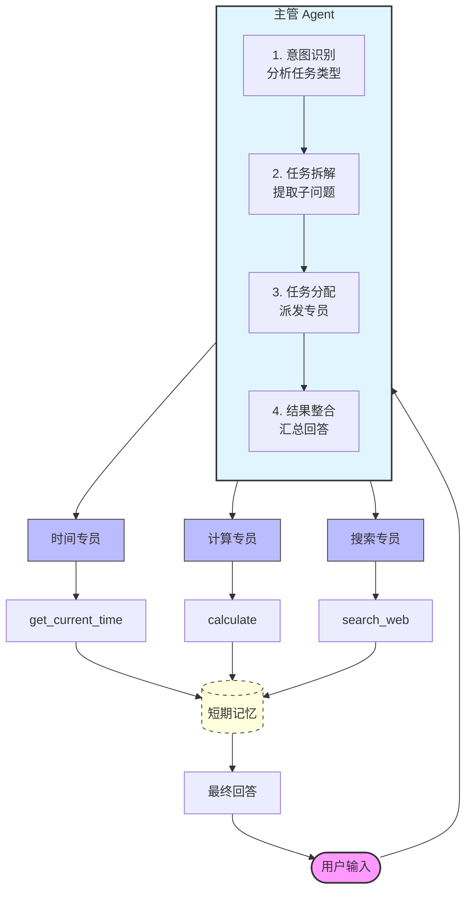

# AI Agent 智能助手

> 一个能记住对话、会上网搜索、会算数的 AI 助手。主管 Agent 自动拆解复杂问题，分派给专业 Agent 执行。

## 目录

- [项目概述](#项目概述)
- [系统架构](#系统架构)
- [核心功能](#核心功能)
- [快速开始](#快速开始)
- [技术栈](#技术栈)
- [项目结构](#项目结构)
- [测试用例](#测试用例)
- [后续计划](#后续计划)

## 项目概述

本项目实现了一个**多智能体协作框架**，通过主管 Agent 统一调度多个专业 Agent，能够智能拆解并执行用户的复杂混合指令。

### 核心能力

- 🔍 **实时搜索**：集成 Tavily 搜索引擎，获取最新信息
- 🧮 **数学计算**：支持复杂表达式计算
- ⏰ **时间查询**：实时获取系统时间
- 💬 **短期记忆**：同一会话内保持上下文连贯
- 🔀 **混合任务处理**：自动拆解多意图问题（如“现在几点了？顺便查一下今天的AI新闻”）

## 系统架构



### 工作流程

1. **用户输入** → 主管 Agent
2. **任务分析**：主管识别问题类型（time / calc / search / none）
3. **子问题提取**：为每个任务提取对应的子问题
4. **任务分配**：派发给对应的专员 Agent
5. **专员执行**：各专员 Agent 独立执行任务
6. **结果整合**：主管汇总所有结果
7. **生成回答**：形成连贯、自然的最终回答
8. **记忆存储**：对话存入短期记忆，供后续使用

## 核心功能

### 1. 多意图识别与拆解

主管 Agent 自动分析用户问题，识别其中包含的多个任务类型，并拆解为独立的子问题。

**示例**：
- 用户输入：`"现在几点了？顺便查一下今天的AI新闻，再算一下15*37"`
- 主管识别：`time`、`search`、`calc` 三个任务
- 分别派发给对应的专员处理

### 2. 实时信息搜索

集成 Tavily 搜索引擎，支持获取最新资讯。搜索结果自动清洗去噪，提取关键内容。

**适用场景**：
- 新闻查询
- 实时信息
- 知识检索

### 3. 数学计算

支持复杂数学表达式计算，包括加减乘除、幂运算等。

**示例**：
- `15 * 37 + 28` → `583`
- `2 ** 10` → `1024`

### 4. 时间查询

实时获取系统当前时间，支持日期和时刻查询。

**示例**：
- `"现在几点了？"` → `当前时间是: 2026-03-20 15:30:00`

### 5. 短期对话记忆

基于 LangGraph MemorySaver 实现，同一会话内保持上下文连贯，支持追问和引用。

**示例**：
- 第一轮：`"我叫小明"`
- 第二轮：`"我叫什么名字？"` → Agent 记得用户叫小明

### 6. 混合任务处理

支持同时处理多个不同类型的任务，并将结果整合为连贯回答。

**示例**：
用户: "现在几点了？顺便查一下今天的AI新闻"
主管: 识别为 time + search
结果: "现在是下午3:30。今天的AI新闻有：OpenAI发布新模型..."


### 7. 结果整合与自然表达

主管 Agent 将多个专员返回的结果整合为一段自然、连贯的文字，而非简单拼接。

## 快速开始

### 环境配置

```bash
# 1. 克隆项目
git clone https://github.com/YeKui7/ai-agent-project.git
cd ai-agent-project

# 2. 创建虚拟环境（Conda）
conda create -n langchain_agent python=3.10 -y
conda activate langchain_agent

# 3. 安装依赖
pip install -r requirements.txt

# 4. 配置 API 密钥
cp .env.example .env
# 编辑 .env 文件，填入 DeepSeek 和 Tavily 的 API 密钥

### 运行示例

from agent import supervisor

response = supervisor("现在几点了？帮我查一下今天的AI新闻")
print(response)
```

## 技术栈

| 组件 | 技术选型 |
|------|---------|
| 核心框架 | LangChain 1.0+ |
| 大语言模型 | DeepSeek (deepseek-chat) |
| 搜索引擎 | Tavily |
| 记忆系统 | LangGraph MemorySaver |
| 开发语言 | Python 3.10 |
| 环境管理 | Conda |

## 项目结构

```text
ai-agent-project/
├── README.md          # 项目说明文档
├── agent.py           # 主程序代码
├── requirements.txt   # Python 依赖包列表
├── .env.example       # 环境变量模板（需复制为 .env）
└── .gitignore         # Git 忽略文件配置
```

## 测试用例

```python
from agent import supervisor

# 单任务测试
print(supervisor("现在几点了？"))
print(supervisor("计算 15 * 37 + 28"))
print(supervisor("帮我查一下今天的AI新闻"))

# 混合任务测试
print(supervisor("现在几点了？顺便查一下今天的AI新闻"))
print(supervisor("计算 15 * 37，然后告诉我现在的时间"))
print(supervisor("帮我搜索最近的科技新闻，再算一下 2 的 10 次方"))
```

### 预期输出示例
```
**单任务测试**
用户: 现在几点了？
助手: 当前时间是 2026-03-20 15:30:00

用户: 计算 15 * 37 + 28
助手: 计算结果: 583

用户: 帮我查一下今天的AI新闻
助手: 今日AI新闻：

OpenAI 发布新一代推理模型

谷歌宣布 Gemini 重大更新

国内大模型厂商发布降价策略


**混合任务测试**
用户: 现在几点了？顺便查一下今天的AI新闻
助手: 现在是下午 3:30。今日 AI 新闻：OpenAI 发布新一代推理模型，谷歌宣布 Gemini 重大更新，国内大模型厂商发布降价策略。

用户: 计算 15 * 37，然后告诉我现在的时间
助手: 15 × 37 = 583。现在是下午 3:30。

用户: 帮我搜索最近的科技新闻，再算一下 2 的 10 次方
助手: 2 的 10 次方等于 1024。最近科技新闻：苹果发布新款 MacBook，特斯拉公布新电池技术。
```

## 后续计划

- [ ] **长期记忆**：接入向量数据库（Chroma / FAISS），实现跨会话记忆用户偏好
- [ ] **Web 界面**：使用 Gradio 或 Streamlit 构建可视化交互界面
- [ ] **更多工具**：扩展天气查询、汇率转换、邮件发送等功能
- [ ] **流式输出**：实现实时逐字显示回答内容
- [ ] **自我反思**：工具调用失败时自动重试或切换方案
- [ ] **多模态支持**：支持图片输入和识别能力
